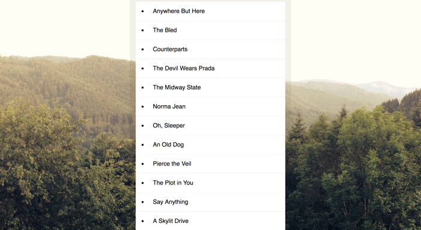

## JavaScript30 Day 17 - Sort Without Articles

In this tutorial, we learn to sort a list of band names and filter out any articles e.g a, an, the inside each item name in the list.

[View demo site here.](https://webdevtuts.github.io/javascript30_17/)

